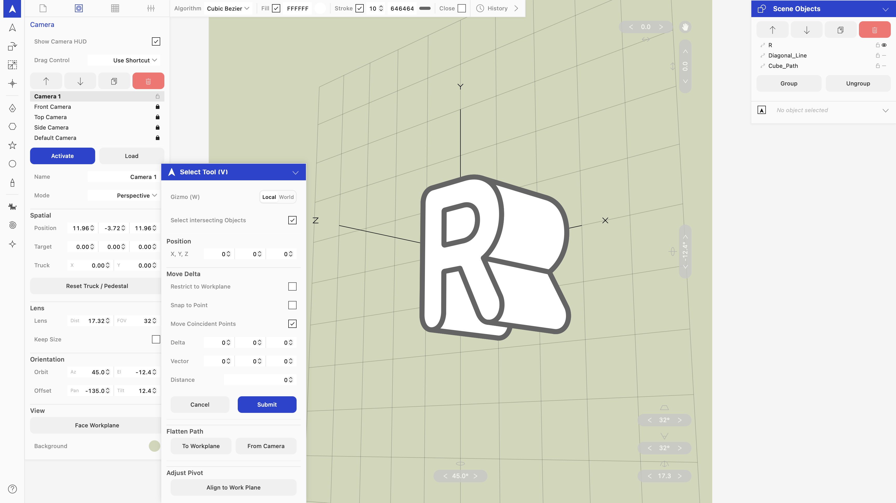

# dim

dim / 3D Application based on SVG for graphic designers.  
Based on concepts of SVG, bezier curves, B-spline curves, perspective projection, orthographic projection, oblique projection.

try the app ↓
https://dim.cog.ooo/dim.html

You can easily import (copy & paste) 2D path images from Adobe Illustrator CC (or other vector graphic software that uses SVG clipboard) to a 3D space and view, transform, extrude, revolve, sweep, map to a spline or a surface, and export (copy & paste) the result back to Adobe Illustrator. 3D matrix operations are applied to vector data. No rasterize.  
Path data are stored as a simple array of 3D coordinates and you can switch the interpolation algorithm between Linear, B-Spline(Cubic), B-Spline(Quadratic), Cubic Bezier. B-Splines will be deconstructed to cubic bezier on SVG rendering and exporting.
It also has a set of vector graphic tools. Pen, Polygon, Star, Ellipse, Doodle, Pixel Art, Spiral, Cycloid, that works inside the 3D space.

Inspired from Adobe dimensions(3.0J),  
the app we used for the book "Arbitary Point P" by Keio University Masahiko Sato Laboratory + Norio Nakamura (https://bijutsu.press/books/2969/) .  
"SiNYO Beta" by Hajime Tachibana,  
Takenobu Igarashi,  
"3D Graphics Programming from Scratch" by Gustavo Pezzi (https://pikuma.com),  
"The Continuity of Splines" by Freya Holmér (https://youtu.be/jvPPXbo87ds),  
"B-Spline Decomposition" by designcoding (https://www.designcoding.net/b-spline-deconstruction/)  
Concept of "Workplane" from Modo by Foundry  
"Interface Craft" by Josh Puckett (https://www.interfacecraft.dev).

## Sample Scenes
[Surface Mapping Sample 01 R on a Square](./scenes/dim_scene_sample_surfacemapping_RtoExtrudedSquare.json),
[Surface Mapping Sample 02 Earth](./scenes/dim_scene_sample_surfacemapping_RtoExtrudedSqudim_scene_sample_Earth.json),

## License
MIT License

Copyright (c) 2026 Masaya Ishikawa

Permission is hereby granted, free of charge, to any person obtaining a copy
of this software and associated documentation files (the "Software"), to deal
in the Software without restriction, including without limitation the rights
to use, copy, modify, merge, publish, distribute, sublicense, and/or sell
copies of the Software, and to permit persons to whom the Software is
furnished to do so, subject to the following conditions:

The above copyright notice and this permission notice shall be included in all
copies or substantial portions of the Software.

THE SOFTWARE IS PROVIDED "AS IS", WITHOUT WARRANTY OF ANY KIND, EXPRESS OR
IMPLIED, INCLUDING BUT NOT LIMITED TO THE WARRANTIES OF MERCHANTABILITY,
FITNESS FOR A PARTICULAR PURPOSE AND NONINFRINGEMENT. IN NO EVENT SHALL THE
AUTHORS OR COPYRIGHT HOLDERS BE LIABLE FOR ANY CLAIM, DAMAGES OR OTHER
LIABILITY, WHETHER IN AN ACTION OF CONTRACT, TORT OR OTHERWISE, ARISING FROM,
OUT OF OR IN CONNECTION WITH THE SOFTWARE OR THE USE OR OTHER DEALINGS IN THE
SOFTWARE.